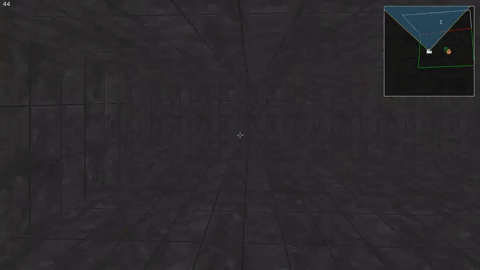
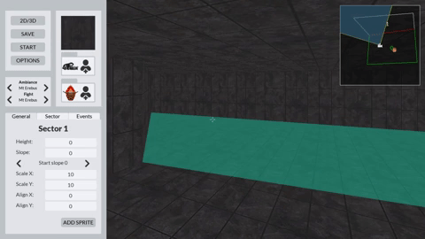

# Doom-Nukem
Doom-Nukem project from 42 school. The goal of the project was to create a game inspired by Duke Nukem and Doom from the early 90's.
We had to reproduce it with the same conditions  as the original games, so we used C and no hardware acceleration.

## Technologies
* C
* SDL2 for graphical rendering
* SDL2_ttf to render text
* FMOD for the audio

## Game features
This project contains two executable files: Doom-Nukem and Doom-editor  
The Doom-Nukem executable is used to run the game with a map created with the Doom-editor application.
```./Doom-Nukem map_path```  
Doom-editor can be used with a map file to edit it ```./Doom-editor map_path```  
or without any map to create a new one ```./Doom-editor```

The main goal of the game is to navigate through levels filled with various obstacles and/or enemies in a 3D like environment.
You'll be able to move using the arrow keys or the WASD keys, jump with the spacebar, crouch with ctrl and sprint with shift.  


During your adventure you'll meet different kind of enemies featuring different behaviors. The ranged enemies will try to fire rockets at you
and the melee enemies will run towards you and inflict damage when colliding with you.
| Ranged Enemies | Melee Enemies |
|----------------|---------------|
|  |  |

You'll also find different objects whether they're only decorations, armor, ammo or even weapons. Some of them are destroyable and may even explode!  


## Editor
The editor consists of a 2D map in which the user may create rooms of various sizes and shapes, and a 3D view to change the wall textures, 
add slopes and check every change realised in real time.  
   
Every property (gravity, floor height, ceiling height etc...) can also be edited with exact values using input boxes  
  
In 2D mode it is possibe to add enemies and objects and then edit their stats (health, speed and damage for example)  
  
The editor also has an incredibly powerful tool, the events panel which enables to create events.  
Events are the core of the game, they allow to create a wide array of actions and animations in the map.  
Events can be triggered in multiple ways:  
* Walking in a sector
* Walking out of a sector
* Standing in a sector
* Pressing a wall sprite (people usually chose the button sprite..)
* Shooting on a wall sprite
* Killing an enemy
* Having a collision with an enemy
* Having a collision with an object
* Or being allways active  
And they can modify almost every property of the map during the gameplay (player health, room shape, enemies damage for example)  
    
An example of these events can be a door  


## Authors
Lucas Nicosia,
Simon Patry,
Gabriel Erhard  
  
*all pictures and gifs of the project were created by Lucas Nicosia* 
